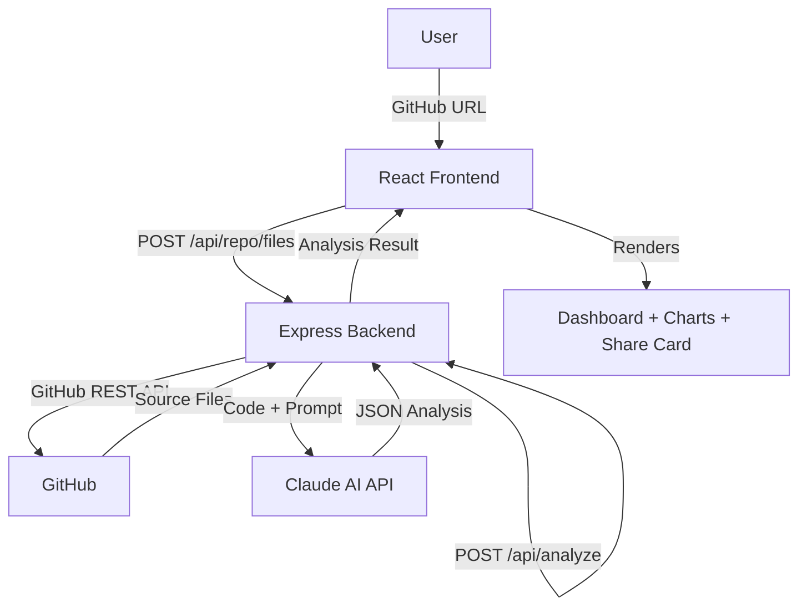

# 🔍 DevLens — AI-Powered Code Review & Skill Gap Analyzer


> Paste any public GitHub repo URL. Get an instant AI-powered code review, a skill radar chart, before/after improvement suggestions, and a personalized learning roadmap — all in seconds.

---

## ✨ Features

- **🧠 AI Code Review** — Claude AI analyzes your actual source files and scores them across 5 engineering dimensions
- **📡 Skill Radar Chart** — Visual spider chart showing Clean Code, Performance, Security, Scalability, and Documentation scores
- **⚡ Before/After Suggestions** — Side-by-side code diff view with AI-generated improvements referencing your actual code
- **🗺️ Learning Roadmap** — Personalized skill gaps with actionable recommendations to level up
- **🎴 Shareable Report Card** — Download a beautiful PNG card or share a link (perfect for LinkedIn)
- **📜 Analysis History** — Local history of past analyses so you can track improvement over time
- **🖥️ Cinematic Terminal UI** — Dark theme with live terminal logging during analysis

---

## 🏗️ Architecture



---

## 🛠️ Tech Stack

| Layer | Technology |
|---|---|
| Frontend | React 18, Vite, Tailwind CSS, Framer Motion |
| Charts | Recharts (Radar/Spider chart) |
| Syntax Highlight | react-syntax-highlighter |
| Export | html2canvas (PNG report card) |
| Backend | Node.js, Express |
| AI | Google Gemini 1.5 Flash (**free** — 15 RPM, 1M tokens/day) |
| GitHub Data | GitHub REST API v3 |
| Rate Limiting | express-rate-limit |

---

## 🚀 Getting Started

### Prerequisites
- Node.js 18+
- A **free** [Google Gemini API key](https://aistudio.google.com/app/apikey) — no credit card, takes 30 seconds
- (Optional) A [GitHub Personal Access Token](https://github.com/settings/tokens) — increases rate limits from 60 to 5000 req/hour

### 1. Clone the repo

```bash
git clone https://github.com/yourusername/devlens.git
cd devlens
```

### 2. Install dependencies

```bash
npm run install:all
```

### 3. Configure environment variables

```bash
# Server
cp server/.env.example server/.env
# Add your ANTHROPIC_API_KEY and optionally GITHUB_TOKEN

# Client (optional — defaults to localhost:5000)
cp client/.env.example client/.env
```

**server/.env**
```
PORT=5000
# FREE key from https://aistudio.google.com/app/apikey
GEMINI_API_KEY=AIza...
GITHUB_TOKEN=ghp_...        # optional but recommended
CLIENT_URL=http://localhost:5173
```

### 4. Run in development

```bash
npm run dev
```

This starts both the Vite dev server (port 5173) and the Express API (port 5000) concurrently.

Open [http://localhost:5173](http://localhost:5173) and paste any public GitHub repo URL.

---

## 📸 Screenshots

> _(Add screenshots of the landing page, analysis loader, and results dashboard here)_

| Landing | Analysis | Results |
|---|---|---|
|  |  |  |

---

## 🌐 Deploying to Production

### Frontend → Vercel

```bash
cd client
npm run build
# Deploy /dist to Vercel — set VITE_API_URL to your Render backend URL
```

### Backend → Render

1. Connect your GitHub repo to [render.com](https://render.com)
2. Set root directory to `server`
3. Build command: `npm install`
4. Start command: `npm start`
5. Add environment variables: `ANTHROPIC_API_KEY`, `GITHUB_TOKEN`, `CLIENT_URL`

---

## 📁 Project Structure

```
devlens/
├── client/                  # React frontend
│   ├── src/
│   │   ├── components/
│   │   │   ├── RadarChart.jsx       # Recharts spider chart
│   │   │   ├── ScoreCard.jsx        # Animated score bars
│   │   │   ├── ImprovementCard.jsx  # Before/after code diff
│   │   │   ├── SkillGapCard.jsx     # Learning roadmap cards
│   │   │   └── ShareCard.jsx        # PNG export modal
│   │   ├── pages/
│   │   │   ├── LandingPage.jsx      # Hero + URL input
│   │   │   ├── AnalyzePage.jsx      # Loading + terminal log
│   │   │   └── ResultsPage.jsx      # Full analysis dashboard
│   │   ├── context/
│   │   │   └── AnalysisContext.jsx  # Global state + history
│   │   └── App.jsx
│   └── package.json
│
├── server/                  # Express backend
│   ├── routes/
│   │   ├── repo.js          # GitHub API integration
│   │   └── analyze.js       # Claude AI analysis endpoint
│   ├── index.js             # Server entry + middleware
│   └── package.json
│
└── package.json             # Monorepo scripts
```

---

## 🧠 How the AI Analysis Works

1. The backend recursively fetches up to 25 source files from the GitHub repo using the GitHub REST API
2. Files are truncated to 3000 chars each and concatenated into a single structured prompt
3. Claude Sonnet is asked to return a strict JSON object with scores, improvements (including actual code snippets from the repo), and skill gaps
4. The JSON is validated and sent to the React frontend, which renders the full dashboard

---

## 💡 What I Learned

Building DevLens taught me a lot about full-stack engineering in practice:

- **Prompt engineering** — Crafting a Claude prompt that returns reliable structured JSON required careful instruction design and defensive parsing
- **GitHub API pagination & rate limits** — Learned to handle 403s gracefully and why auth tokens matter
- **Frontend state management** — Used React Context for analysis state and localStorage for history without external state libraries
- **Performance trade-offs** — Balancing how many files to fetch (cost/latency) vs. analysis depth
- **UI polish matters** — Framer Motion, the terminal loader, and the exportable card transformed this from a "demo" to something people actually want to share

---

## 🤝 Contributing

PRs are welcome! Some ideas for contributions:
- Add GitHub OAuth so users can analyze private repos
- Supabase integration to persist analysis history across devices
- Support for GitLab / Bitbucket URLs
- Diff view with line-by-line highlighting

---

## 📄 License

MIT — free to use, fork, and build on.

---

<p align="center">Built by <a href="https://github.com/yourusername">@yourusername</a> · Powered by Claude AI</p>
